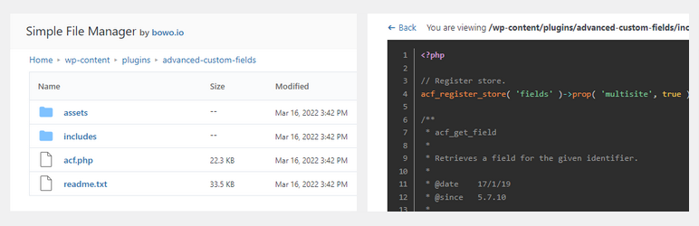
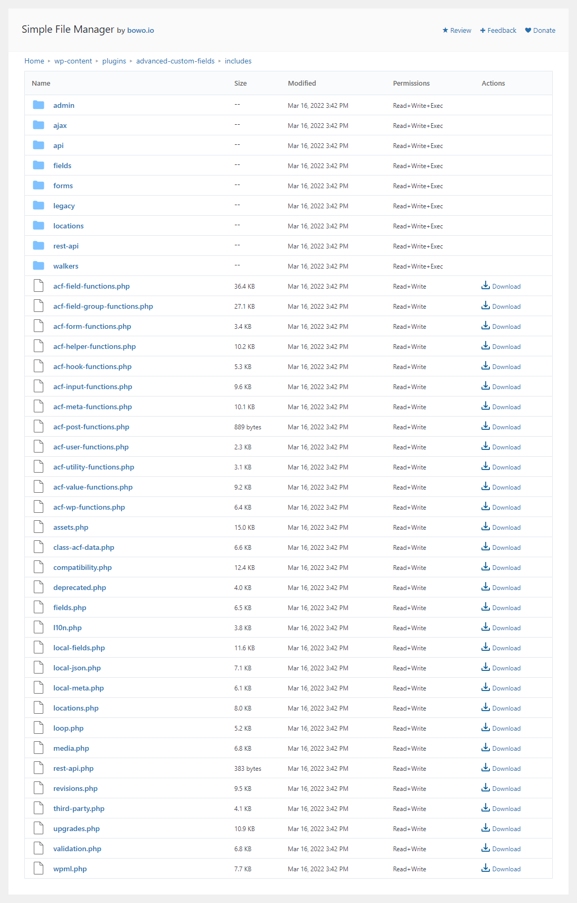
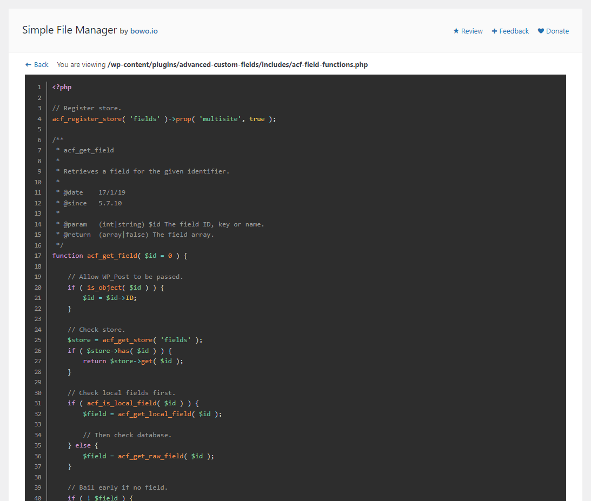

# Simple File Manager

Contributors: qriouslad  
Donate link: https://paypal.me/qriouslad
Tags: file manager, file viewer, code viewer, developer  
Requires at least: 4.8  
Tested up to: 5.9.3  
Stable tag: 1.3.0  
Requires PHP: 5.6  
License: GPLv2 or later  
License URI: http://www.gnu.org/licenses/gpl-2.0.html

Lightweight file manager focusing as a code viewer and editor with syntax highlighting.

## Description

**Simple File Manager** allows you to swiftly browse through the directories and files in your WordPress installation. A good alternative for [File Manager](https://wordpress.org/plugins/wp-file-manager/), [Filester - File Manager Pro](https://wordpress.org/plugins/filester/) and [Advanced File Manager](https://wordpress.org/plugins/file-manager-advanced/) if your primary focus is viewing directory content and viewing / editing the code inside files. 

[CodeMirror](https://codemirror.net/) is used for highlighting syntax in files commonly used throughout the WordPress development cycle such as PHP, HTML, Javascript, CSS, JSON and Markdown files.

Simple File Manager is based on the [Simple File Manager](https://github.com/jcampbell1/simple-file-manager) library by [John Campbell](https://github.com/jcampbell1).

### Give Back

* [A nice review](https://wordpress.org/plugins/tiny-file-manager/#reviews) would be great!
* [Give feedback](https://wordpress.org/support/plugin/tiny-file-manager/) and help improve future versions.
* [Github repo](https://github.com/qriouslad/tiny-file-manager) to contribute code.
* [Donate](https://paypal.me/qriouslad) and support my work.

## Screenshots

1. The file manager
   
2. The file/code viewer
   

## Frequently Asked Questions

### How was this plugin built?

System Dashboard was built with: [WordPress Plugin Boilerplate](https://github.com/devinvinson/WordPress-Plugin-Boilerplate/) | [wppb.me](https://wppb.me/) | [CodeStar framework](https://github.com/Codestar/codestar-framework)

## Changelog

### 1.3.0 (2022.04.19)

* SECURITY: implement nonces for file edit, file upload, file creation and folder creation

### 1.2.0 (2022.04.16)

* NEW: file upload, file creation and folder creation
* ENHANCEMENT: add admin capability check to ensure only site admins can access the file manager

### 1.1.0 (April 2022)

* NEW: file editing is now possible and uses CodeMirror for the editor
* ENHANCEMENT: Replace prism.js with CodeMirror for syntax highlighting when viewing files

### 1.0.0 (April 2022)

* Initial stable release

## Upgrade Notice

None required yet.